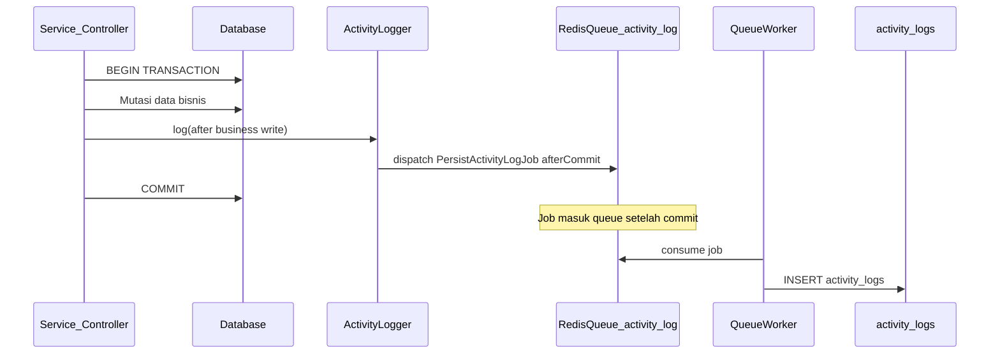
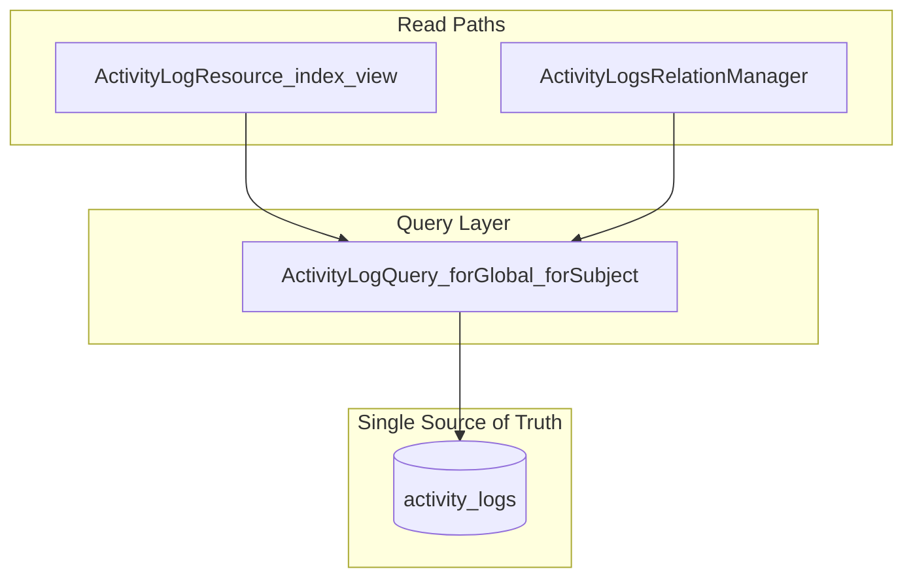
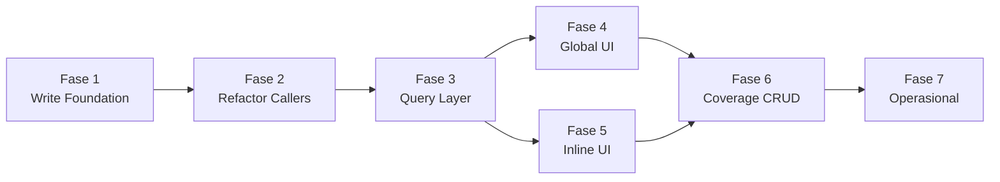

# Laporan Analisis: Custom Activity Logging System

> Dokumen ini merangkum keputusan desain, kondisi kode saat ini, dan rencana implementasi untuk sistem activity log custom dengan penulisan async via Redis queue.
> Dibuat berdasarkan diskusi requirement dan eksplorasi codebase `apps/backoffice-filament`.

---

## Ringkasan Keputusan

| Aspek | Keputusan |
|-------|-----------|
| Sumber data | **Single source of truth:** tabel `activity_logs` + model `ActivityLog` (custom, bukan Spatie) |
| Penulisan log | **Fire-and-forget** via Laravel Queue Job di Redis, queue khusus `activity-log` |
| Timing dispatch | **`afterCommit`** — job di-dispatch setelah transaksi DB sukses commit |
| Kegagalan log | **Best-effort** — kegagalan logging tidak boleh menggagalkan transaksi bisnis |
| UI global | Menu **Activity Log** (Filament resource read-only) |
| UI per record | Tab/RelationManager di halaman view resource tertentu |
| Akses global | **Administrator only** |
| Akses inline | **Ikut akses resource induk** (role read-only boleh lihat log resource yang bisa dibuka) |
| Resource inline (fase 1) | Member, Staff, Reward, Branch, Content, PointMutation, RedeemInvoice, PointInjectionBatch |

---

## Kondisi Kode Saat Ini

### Yang Sudah Ada

| Komponen | Lokasi | Catatan |
|----------|--------|---------|
| Tabel `activity_logs` | `database/migrations/2026_06_24_100035_create_activity_logs_table.php` | UUID PK, index `(auditable_type, auditable_id)` |
| Model `ActivityLog` | `app/Models/ActivityLog.php` | `before_json` / `after_json`, relasi `user()` |
| Factory + Seeder | `database/factories/ActivityLogFactory.php`, `ActivityLogSeeder.php` | Data dummy |
| Penulisan manual (sync) | `ManualPointInjectionService`, `ProcessBatchService` | `ActivityLog::query()->create([...])` di dalam transaksi DB |
| Konvensi bisnis | `AGENTS.md` | `user_id` → `users`, bukan `staff_id` |
| Redis config | `config/database.php`, `config/queue.php` | Redis tersedia; default queue masih `database` |
| Pola queue existing | `bulk-injection` queue di bulk update | Precedent untuk queue khusus per domain |

### Yang Belum Ada

| Komponen | Keterangan |
|----------|------------|
| `ActivityLogger` service | Entry point tunggal untuk semua penulisan log |
| `PersistActivityLogJob` | Job async menulis ke `activity_logs` |
| Queue `activity-log` | Queue Redis dedicated + worker command |
| `ActivityLogResource` | Menu global read-only di Filament |
| `ActivityLogsRelationManager` | Tab riwayat di view record |
| Relasi `morphTo` / query helper | Query log per subject secara konsisten |
| Refactor service existing | `ManualPointInjectionService`, `ProcessBatchService` masih sync inline |

---

## Arsitektur Target

### Prinsip

1. **Satu pintu masuk tulis** — semua kode aplikasi memanggil `ActivityLogger`, tidak langsung `ActivityLog::create()`.
2. **Satu pintu masuk baca** — UI global dan inline memakai `ActivityLogQuery` (atau scope model) yang sama.
3. **Async tidak mengorbankan konsistensi bisnis** — `afterCommit` memastikan log hanya di-queue jika transaksi induk berhasil.
4. **Audit best-effort** — jika Redis/worker down, transaksi bisnis tetap sukses; kegagalan log dicatat ke application log (Monolog) untuk monitoring.

### Diagram Alur Penulisan



### Diagram Alur Pembacaan



---

## Desain Komponen

### 1. `ActivityLogger` (Write API)

Service tunggal yang dipanggil dari service layer, Filament actions, atau event listener.

```php
ActivityLogger::log(
    action: 'manual_point_injection',
    description: 'Suntik poin manual oleh staff',
    auditable: $mutation,           // Model|string type + id
    before: [...],
    after: [...],
    actor: auth()->user(),          // nullable untuk system job
);
```

**Tanggung jawab:**
- Normalisasi `auditable_type` (short class name: `PointMutation`, bukan FQCN)
- Resolve `user_id` dari actor (`User`, bukan `Staff`)
- Capture `ip_address` dari request (fallback `0.0.0.0` untuk CLI/queue)
- Dispatch `PersistActivityLogJob` ke queue `activity-log` dengan `afterCommit()`
- Wrap dispatch dalam try/catch — failure hanya `Log::warning()`, tidak throw

### 2. `PersistActivityLogJob`

```php
// app/Jobs/PersistActivityLogJob.php
class PersistActivityLogJob implements ShouldQueue
{
    public string $queue = 'activity-log';
    public int $tries = 3;
    public array $backoff = [10, 30, 60];
    // payload: DTO/array primitif, bukan Model (hindari stale serialization)
}
```

**Catatan implementasi:**
- Payload berisi data primitif (string, array) — jangan serialize Eloquent model
- `afterCommit` di-set saat dispatch dari `ActivityLogger`, bukan di constructor job
- Failed job masuk `failed_jobs` — bisa di-retry manual atau via Horizon nanti

### 3. `ActivityLogQuery` (Read API)

```php
ActivityLogQuery::forSubject('PointMutation', $id)->latest();
ActivityLogQuery::global()
    ->when($filters['action'], ...)
    ->when($filters['user_id'], ...)
    ->when($filters['date_range'], ...);
```

**Index yang sudah ada:** `(auditable_type, auditable_id)`, `user_id`.

**Index tambahan yang disarankan (fase implementasi):**
- `created_at` — untuk sort/filter global
- `(action, created_at)` — opsional, jika filter action sering dipakai

### 4. UI Filament

#### A. Menu Global — `ActivityLogResource`

| Aspek | Nilai |
|-------|-------|
| Grup navigasi | `Konfigurasi` atau `Manajemen Pengguna` |
| Halaman | `index` + `view` saja (read-only) |
| Akses | `canAccess()` → administrator only (sama pola `StaffResource`, `RoleResource`) |
| Kolom index | waktu, user, action, auditable_type, auditable_id, description (truncate), IP |
| Filter | tanggal, user, action, auditable_type |
| Halaman view | infolist: metadata + diff `before_json` / `after_json` (human-readable) |

#### B. Inline — `ActivityLogsRelationManager`

Resource yang mendapat tab di fase 1:

| Resource | `auditable_type` contoh |
|----------|-------------------------|
| Member | `Member` |
| Staff | `Staff` |
| Reward | `Reward` |
| Branch | `Branch` |
| Content | `Content` |
| PointMutation | `PointMutation` |
| RedeemInvoice | `RedeemInvoice` |
| PointInjectionBatch | `PointInjectionBatch` |

**Pola implementasi:**
- Satu `ActivityLogsRelationManager` generik (bukan relationship Eloquent — query manual via `ActivityLogQuery::forSubject()`)
- Atau trait `HasActivityLogRelationManager` yang di-register di `getRelations()` masing-masing resource
- Akses: inherit dari parent resource policy (`canView` record induk)

**Catatan:** Log untuk operasi pada *child entity* (misal edit stok cabang) tetap muncul di tab parent jika `auditable_type` mengarah ke parent, atau di global menu jika `auditable_type` adalah entity child. Keputusan: **log selalu keyed ke entity yang paling relevan untuk audit**, dokumentasikan per action.

---

## Konvensi Data

### Schema `activity_logs` (existing — tidak perlu diubah fase 1)

| Kolom | Tipe | Keterangan |
|-------|------|------------|
| `id` | UUID | PK |
| `user_id` | UUID nullable | FK `users` — actor |
| `action` | string(100) | Slug machine-readable, snake_case |
| `description` | text | Human-readable bahasa Indonesia |
| `auditable_type` | string(100) | Short name: `Member`, `PointMutation` |
| `auditable_id` | string(50) | UUID atau kode record |
| `before_json` | JSON nullable | State sebelum perubahan |
| `after_json` | JSON nullable | State sesudah perubahan |
| `ip_address` | string(45) | IPv4/IPv6 |
| `created_at` | timestamp | Waktu kejadian (bukan `updated_at`) |

### Taxonomy `action` (draft)

| Action | Trigger | auditable_type |
|--------|---------|----------------|
| `manual_point_injection` | Suntik poin manual | `PointMutation` |
| `bulk_point_injection` | Proses batch upload | `PointInjectionBatch` |
| `member_created` | CRUD member | `Member` |
| `member_updated` | CRUD member | `Member` |
| `reward_updated` | CRUD reward | `Reward` |
| `content_published` | Publish konten | `Content` |
| `redeem_completed` | Klaim redeem | `RedeemInvoice` |
| ... | Tambah seiring implementasi | ... |

Gunakan konstanta enum atau class `ActivityLogAction` agar tidak ada typo antar caller.

### Field yang **tidak boleh** masuk `before_json` / `after_json`

- Password / hash
- Token API / OTP
- Data kartu / PII sensitif yang tidak perlu untuk audit

---

## Konfigurasi Queue

### Environment

```env
QUEUE_CONNECTION=redis          # production
REDIS_QUEUE=default
# Queue khusus activity-log di-set di job class, bukan env global
```

### Worker command (development & production)

```bash
php artisan queue:work redis --queue=activity-log --tries=3 --backoff=10,30,60
```

**Produksi:** jalankan sebagai supervisor/systemd process terpisah dari worker `bulk-injection`.

### Perilaku saat Redis down

| Skenario | Perilaku |
|----------|----------|
| Dispatch gagal (Redis unreachable) | `Log::warning()` + transaksi bisnis tetap sukses |
| Job gagal 3x | Masuk `failed_jobs`, alert ops |
| Worker mati sementara | Job menumpuk di Redis, diproses saat worker hidup kembali |
| Transaksi DB rollback | Job tidak pernah di-dispatch (`afterCommit`) |

---

## Matrix Akses

| Role | Menu Global Activity Log | Tab inline di view record |
|------|------------------------|---------------------------|
| `administrator` | Ya | Ya (semua resource inline) |
| `super_admin` | Tidak | Ya, hanya resource yang bisa diakses super_admin |
| `marketing` | Tidak | Ya, hanya resource read-only yang boleh dibuka |
| `store_manager` | Tidak | Ya, hanya resource read-only yang boleh dibuka |
| `member` | Tidak | Tidak |

**Shield permission (fase implementasi):**
- Resource global: `ViewAny:ActivityLog`, `View:ActivityLog` — assign hanya ke `administrator`
- Inline: tidak perlu permission terpisah; inherit parent resource `view` policy

---

## Migrasi dari Penulisan Sync Existing

### File yang perlu direfactor

| File | Perubahan |
|------|-----------|
| `ManualPointInjectionService.php` | Ganti `ActivityLog::query()->create()` → `ActivityLogger::log()` |
| `ProcessBatchService.php` | Idem |
| Test terkait | Assert log muncul setelah `Queue::fake()` + job dispatch, atau `Bus::fake()` + manual job handle |

### Strategi refactor

1. Implement `ActivityLogger` + `PersistActivityLogJob` dulu
2. Refactor 2 service loyalty sebagai reference implementation
3. Tambah UI read (global + inline) — bisa ditest dengan data seeder/factory existing
4. Rollout logging ke resource CRUD lain secara bertahap via Filament model observers atau explicit calls di form actions

**Penting:** Setelah refactor, penulisan log **keluar dari transaksi DB** (di-queue after commit). Test yang assert log dalam transaction perlu di-update: either sync fake queue atau `Bus::dispatchSync()` di environment testing.

---

## Inventaris Kode (Pemetaan Lengkap)

### Stack & dependensi yang relevan

| Komponen | Nilai saat ini | Dampak ke logging |
|----------|----------------|-------------------|
| `QUEUE_CONNECTION` | `redis` (`.env`) | Siap untuk async; worker `bulk-injection` sudah jalan via `composer dev` |
| Redis | Docker `6381`, client `predis` | Queue `activity-log` bisa ditambah tanpa infra baru |
| Prisma `ActivityLog` | `packages/database/schema.prisma:797-814` | Sinkron dengan migration Laravel — **tidak perlu ubah schema fase awal** |
| Shield super admin | role `administrator` via gate | Pola akses global menu = sama `StaffResource::canAccess()` |
| Filament split structure | `Resources/{Name}/Schemas|Tables|Pages|RelationManagers` | UI logging ikuti pola ini |

### Yang sudah ada (siap dipakai)

| File | Peran | Catatan implementasi |
|------|-------|----------------------|
| `database/migrations/2026_06_24_100035_create_activity_logs_table.php` | DDL | Index: `user_id`, `(auditable_type, auditable_id)` — belum ada index `created_at` |
| `app/Models/ActivityLog.php` | Model baca/tulis | `$timestamps = false`; cast JSON; relasi `user()` saja — **belum ada** `morphTo`, scope, atau query helper |
| `app/Models/User.php` | `hasMany(ActivityLog)` | Actor selalu `users.id`, bukan `staffs.id` |
| `database/factories/ActivityLogFactory.php` | Data dummy UI/test | Action default `manual_point_injection` |
| `database/seeders/ActivityLogSeeder.php` | 5 record seed | Dipanggil dari `DatabaseSeeder` |
| `ManualPointInjectionService` | Tulis sync dalam transaksi | `ActivityLog::create()` baris 98–118; `auditable_type = PointMutation` |
| `ProcessBatchService` | Tulis sync dalam transaksi | `ActivityLog::create()` baris 187–204; `auditable_type = PointInjectionBatch` |
| `ProcessPointInjectionBatchJob` | Memanggil `ProcessBatchService` | Queue `bulk-injection`; actor + IP di-pass dari Filament action |
| `InjectManualPointAction` | Entry point UI suntik manual | Pass `request()->ip()` ke service |
| `ProcessBulkInjectionJob` | Import Excel async | **Tidak** menulis activity log (hanya validasi baris) |
| `tests/Feature/Loyalty/ManualPointInjectionServiceTest.php` | Assert log sync | Query langsung `ActivityLog` setelah `inject()` |
| `tests/Feature/Loyalty/ProcessBatchServiceTest.php` | Assert log sync | Assert `bulk_point_injection` pada batch |
| `BranchStocksRelationManager` | Precedent RelationManager custom query | Pola `->query(fn () => ...)` tanpa relasi Eloquent — **referensi untuk tab inline log** |
| `ViewBranch` | Custom tab RelationManager | Pola `mountedRelationManagers` + tab switch — bisa diikuti jika tab log di Branch ramai |

### Yang belum ada

| Komponen | Prioritas |
|----------|-----------|
| `app/Services/ActivityLog/ActivityLogger.php` | Fase 1 |
| `app/Jobs/PersistActivityLogJob.php` | Fase 1 |
| `app/Data/ActivityLog/ActivityLogData.php` | Fase 1 |
| `app/Enums/ActivityLogAction.php` | Fase 1 |
| `app/Support/ActivityLog/ActivityLogQuery.php` (atau `app/Services/ActivityLog/`) | Fase 3 |
| `app/Policies/ActivityLogPolicy.php` | Fase 4 |
| `app/Filament/Resources/ActivityLogs/` | Fase 4 |
| `app/Filament/Resources/*/RelationManagers/ActivityLogsRelationManager.php` (generik/shared) | Fase 5 |
| Worker `activity-log` di `composer.json` scripts `dev` / `dev:flyenv` | Fase 1 |
| Shield permission `ViewAny:ActivityLog`, `View:ActivityLog` di `ShieldRolesSeeder` | Fase 4 |

### Mapping `auditable_type` saat ini vs tab inline

Ini menentukan **log apa yang muncul di tab resource mana**. Penting sebelum Fase 5:

| Operasi | `action` | `auditable_type` | `auditable_id` | Tab inline yang cocok |
|---------|----------|------------------|----------------|----------------------|
| Suntik poin manual | `manual_point_injection` | `PointMutation` | UUID mutasi | **PointMutation** (bukan Member) |
| Proses batch massal | `bulk_point_injection` | `PointInjectionBatch` | UUID batch | **PointInjectionBatch** |
| (belum ada) CRUD Member | `member_*` | `Member` | UUID member | **Member** |
| (belum ada) CRUD Staff | `staff_*` | `Staff` | int staff id | **Staff** |

**Implikasi:** Tab "Riwayat Aktivitas" di halaman **Member** tidak akan menampilkan suntikan poin manual kecuali:
- ditambah log kedua dengan `auditable_type = Member`, atau
- RelationManager Member melakukan query gabungan (mutasi terkait + log member), atau
- `auditable_type` diubah ke `Member` untuk operasi suntik (kehilangan link langsung ke mutasi).

**Keputusan sementara (disarankan):** pertahankan keying ke entity operasi (`PointMutation`, `PointInjectionBatch`). Tab Member hanya menampilkan log yang `auditable_type = Member`. Untuk audit suntik poin, gunakan tab **PointMutation** (perlu halaman View) atau menu global.

### Gap UI resource (halaman View)

RelationManager Filament butuh halaman **View** atau **Edit** yang mendaftarkan relasi:

| Resource | Halaman View | Siap tab inline? |
|----------|--------------|------------------|
| Member | ✅ `ViewMember` | ✅ |
| Staff | ✅ `ViewStaff` | ✅ |
| Reward | ✅ `ViewReward` | ✅ |
| Branch | ✅ `ViewBranch` (custom tabs) | ✅ |
| RedeemInvoice | ✅ `ViewRedeemInvoice` | ✅ |
| PointInjectionBatch | ✅ `ViewPointInjectionBatch` | ✅ |
| Content | ❌ hanya List/Create/Edit | ⚠️ perlu `ViewContent` **atau** mount di `EditContent` |
| PointMutation | ❌ hanya List | ⚠️ perlu `ViewPointMutation` + infolist (log suntik manual ada di sini) |

---

## Rencana Fase Development

> Urutan di bawah adalah dependency order. Setiap fase punya **deliverable**, **kriteria selesai**, dan **file utama**. Estimasi relatif — fase bisa dikerjakan per PR terpisah.



---

### Fase 1 — Write Foundation (infra async)

**Tujuan:** Satu pintu masuk tulis (`ActivityLogger`) + job Redis `activity-log` + `afterCommit`, tanpa mengubah perilaku bisnis existing.

**Deliverable:**

| File baru | Tanggung jawab |
|-----------|----------------|
| `app/Enums/ActivityLogAction.php` | Konstanta action: `ManualPointInjection`, `BulkPointInjection`, dst. — method `value(): string` snake_case |
| `app/Data/ActivityLog/ActivityLogData.php` | DTO readonly primitif (payload job) |
| `app/Services/ActivityLog/ActivityLogger.php` | Normalisasi type/id, resolve `user_id`, capture IP, dispatch job |
| `app/Jobs/PersistActivityLogJob.php` | `ShouldQueue`, queue `activity-log`, `tries=3`, `backoff=[10,30,60]` |

**Tugas:**

- [ ] Implement `ActivityLogger::log(...)` dengan signature dari desain di atas
- [ ] Normalizer `auditable_type`: short class name (`PointMutation`), bukan FQCN
- [ ] Normalizer `auditable_id`: `(string) $model->getKey()` — kompatibel UUID dan int (`Staff`)
- [ ] Dispatch: `PersistActivityLogJob::dispatch($data)->onQueue('activity-log')->afterCommit()`
- [ ] Try/catch dispatch → `Log::warning()` saja, tidak throw
- [ ] IP fallback: `request()?->ip() ?? '0.0.0.0'`; caller boleh override (seperti pola existing `$ipAddress` param)
- [ ] Update `composer.json` script `dev` / `dev:flyenv`: tambah worker `--queue=activity-log,bulk-injection` (atau process terpisah di concurrently)
- [ ] Dokumentasi worker di komentar `.env` (sejajar komentar `bulk-injection` existing)

**Kriteria selesai:**

- Job masuk Redis queue `activity-log` setelah transaksi commit
- Job tidak di-dispatch jika transaksi rollback
- Kegagalan Redis tidak membatalkan transaksi bisnis
- `php artisan queue:work redis --queue=activity-log` berhasil INSERT ke `activity_logs`

**Test (bila diminta user):**

- Feature test `ActivityLoggerTest`: `Bus::fake()` + assert dispatched with `afterCommit`
- Feature test rollback: transaksi gagal → job tidak ter-dispatch
- Feature test job handle: `PersistActivityLogJob` menulis record valid ke DB

**Belum termasuk fase ini:** refactor service loyalty, UI, Shield.

---

### Fase 2 — Refactor Caller Existing (loyalty)

**Tujuan:** Dua titik tulis sync saat ini memakai `ActivityLogger`; perilaku audit tetap sama, timing berubah (async after commit).

**File yang diubah:**

| File | Perubahan |
|------|-----------|
| `app/Services/Loyalty/ManualPointInjectionService.php` | Ganti `ActivityLog::query()->create([...])` → `ActivityLogger::log(ActivityLogAction::ManualPointInjection, ...)` |
| `app/Services/Loyalty/ProcessBatchService.php` | Idem untuk `BulkPointInjection` |
| `tests/Feature/Loyalty/ManualPointInjectionServiceTest.php` | Assert via `Queue::fake()` + `Bus::assertDispatched(PersistActivityLogJob::class)` **atau** `Bus::dispatchSync()` di testing |
| `tests/Feature/Loyalty/ProcessBatchServiceTest.php` | Idem |

**Tugas:**

- [ ] Inject `ActivityLogger` ke constructor service (constructor promotion, ikuti pola `PointCalculationService`)
- [ ] Payload `before_json` / `after_json` tetap identik dengan sekarang (test backward-compatible)
- [ ] Pastikan `ProcessPointInjectionBatchJob` tetap valid — logging terjadi di dalam `ProcessBatchService::process()` setelah commit transaksi service
- [ ] Hapus import `ActivityLog` dari service jika tidak dipakai lagi

**Kriteria selesai:**

- Semua test loyalty existing lulus (dengan strategi assert job, bukan query sync langsung)
- Setelah inject manual + worker jalan, record muncul di `activity_logs` dengan data sama seperti sebelum refactor
- Rollback transaksi (member suspended, duplicate receipt) → tidak ada log baru

**Catatan testing:**

Test saat ini assert `ActivityLog::query()->count()` **sinkron dalam transaksi**. Setelah refactor, pilih salah satu:
1. `Queue::fake()` + assert job dispatched (unit behavior), atau
2. `Bus::dispatchSync()` / `PersistActivityLogJob::dispatchSync()` di `phpunit.xml` env testing, atau
3. Jalankan job handle manual di test: `$job->handle()`

Rekomendasi: kombinasi (1) untuk dispatch contract + (3) untuk assert isi DB.

---

### Fase 3 — Read / Query Layer

**Tujuan:** Satu pintu masuk baca untuk global menu dan tab inline.

**Deliverable:**

| File | Tanggung jawab |
|------|----------------|
| `app/Support/ActivityLog/ActivityLogQuery.php` | `forSubject(string $type, string $id)`, `global()`, filter helpers |
| `app/Support/ActivityLog/AuditableTypeRegistry.php` (opsional) | Label ID → human label ID, resolve link ke Filament resource |
| `app/Support/ActivityLog/ActivityLogDiffPresenter.php` (opsional, bisa Fase 4) | Format `before_json`/`after_json` untuk infolist |

**Tugas:**

- [ ] `forSubject()`: `ActivityLog::query()->where('auditable_type', $type)->where('auditable_id', $id)->latest('created_at')`
- [ ] `global()`: base query dengan eager load `user` (hindari N+1 di index)
- [ ] Filter: `action`, `user_id`, `auditable_type`, rentang `created_at`
- [ ] Helper `displayAction(ActivityLog $log): string` — map slug → label Indonesia
- [ ] Helper resolve actor: `user` null → tampilkan "Sistem"
- [ ] (Opsional) Method `forMember(Member $member)` jika nanti perlu gabung log terkait — **tunda ke Fase 6**

**Kriteria selesai:**

- Query layer bisa dipakai dari Filament table `->query()` tanpa duplikasi di Resource/RelationManager
- Pagination + sort `created_at desc` performa acceptable pada data seeder (5–100 row)

**Index DB (bisa sub-task fase ini atau Fase 7):**

- [ ] Migration: index `created_at`
- [ ] Migration opsional: `(action, created_at)` jika filter action sering

---

### Fase 4 — Global UI (`ActivityLogResource`)

**Tujuan:** Menu read-only **Log Aktivitas** — hanya role `administrator`.

**Struktur Filament (ikuti split structure):**

```
app/Filament/Resources/ActivityLogs/
├── ActivityLogResource.php
├── Pages/
│   ├── ListActivityLogs.php
│   └── ViewActivityLog.php
├── Tables/
│   └── ActivityLogsTable.php
└── Schemas/
    └── ActivityLogInfolist.php
```

**Tugas:**

- [ ] `ActivityLogResource`: `canCreate/edit/delete = false`; halaman `index` + `view` saja
- [ ] `canAccess()`: `Auth::user()?->hasRole(Utils::getSuperAdminName())` — copy pola `StaffResource`
- [ ] Navigation: grup `Konfigurasi` atau `Manajemen Pengguna`; label `Log Aktivitas`; icon `Heroicon::OutlinedClipboardDocumentList`
- [ ] Kolom index: waktu, user (atau "Sistem"), action (label ID), tipe entitas, ID entitas, deskripsi (truncate), IP
- [ ] Filter: tanggal, user, action, auditable_type
- [ ] View infolist: metadata + section diff before/after (table key-value dulu — keputusan UI #4 di pertanyaan terbuka)
- [ ] `app/Policies/ActivityLogPolicy.php`: `viewAny`/`view` → administrator; `create/update/delete/restore/forceDelete` → false
- [ ] `ShieldRolesSeeder`: generate permission `ViewAny:ActivityLog`, `View:ActivityLog`; assign hanya `administrator`; `revokeAdminOnlyPermissionsForRole` untuk role lain
- [ ] `config/filament-shield.php`: pastikan resource ter-discover setelah `shield:generate`

**Kriteria selesai:**

- Login sebagai `administrator` → menu terlihat, bisa filter & buka detail
- Login sebagai `super_admin` / `marketing` → menu **tidak** terlihat di navigasi
- Data dari `ActivityLogSeeder` + loyalty injection tampil benar

---

### Fase 5 — Inline UI (`ActivityLogsRelationManager`)

**Tujuan:** Tab **Riwayat Aktivitas** di halaman view record — akses inherit policy resource induk.

**Deliverable:**

| File | Catatan |
|------|---------|
| `app/Filament/Resources/Concerns/HasActivityLogsRelationManager.php` (trait) | `getRelations()` return `ActivityLogsRelationManager::class` |
| `app/Filament/Resources/ActivityLogs/RelationManagers/ActivityLogsRelationManager.php` | Generik: terima `auditableType` dari owner model |

**Pola implementasi** (ikut `BranchStocksRelationManager`):

```php
// Bukan Eloquent relationship — custom query:
->query(fn () => ActivityLogQuery::forSubject(
    AuditableTypeRegistry::forModel($this->getOwnerRecord()),
    (string) $this->getOwnerRecord()->getKey(),
))
```

**Tugas per resource:**

| Resource | Prasyarat | `auditable_type` |
|----------|-----------|------------------|
| Member | — | `Member` |
| Staff | — | `Staff` |
| Reward | — | `Reward` |
| Branch | register di `ViewBranch` jika pakai custom tabs | `Branch` |
| RedeemInvoice | — | `RedeemInvoice` |
| PointInjectionBatch | — | `PointInjectionBatch` |
| Content | **buat `ViewContent`** atau mount di Edit | `Content` |
| PointMutation | **buat `ViewPointMutation` + infolist** | `PointMutation` |

- [ ] RelationManager: kolom waktu, user, action, deskripsi; link ke global view jika user administrator
- [ ] `canViewForRecord()`: return `$this->getPageClass()::canView($this->getOwnerRecord())` atau policy induk
- [ ] Empty state: "Belum ada riwayat aktivitas untuk record ini"
- [ ] Register trait/`getRelations()` di masing-masing `*Resource.php` + halaman View

**Sub-fase 5a — Halaman View yang belum ada:**

- [ ] `Contents/Pages/ViewContent.php` + route di `ContentResource::getPages()`
- [ ] `PointMutations/Pages/ViewPointMutation.php` + `PointMutationInfolist` (read-only detail mutasi)
- [ ] Tombol view dari table index (aksi row)

**Kriteria selesai:**

- Tab muncul di View record untuk 8 resource
- User dengan `View:Member` (marketing read-only) melihat tab di Member, **tidak** melihat menu global
- Log loyalty existing (`PointMutation`, `PointInjectionBatch`) tampil di tab yang sesuai setelah worker memproses job

---

### Fase 6 — Coverage Expansion (instrumentasi tulis)

**Tujuan:** Semua operasi CRUD/aksi penting memanggil `ActivityLogger` — bukan hanya loyalty.

**Prioritas rollout:**

| Domain | Trigger | `action` (draft) | Lokasi integrasi |
|--------|---------|------------------|------------------|
| Member | create / update / suspend | `member_created`, `member_updated`, `member_suspended` | `CreateMember`, `EditMember`, atau Observer |
| Staff | create / update / delete | `staff_*` | `StaffResource` pages |
| Reward | create / update | `reward_*` | `RewardResource` + `BranchStocksRelationManager` untuk stok |
| Branch | create / update | `branch_*` | `BranchResource` pages |
| Content | create / update / publish | `content_*` | `ContentFormSupport` / pages |
| Redeem | confirm / cancel | `redeem_*` | Service redeem (jika ada) atau Filament action |
| Tier / Conversion | update rules | `tier_*`, `conversion_rule_*` | `TierMemberResource` |
| Promotion banner | update | `promotion_banner_updated` | `PromotionBannerPage` |

**Tugas:**

- [ ] Tentukan strategi integrasi: **explicit call di Page/Support** (preferred, konsisten codebase) vs Model Observer (hati-hati noise)
- [ ] Sanitizer `before_json`/`after_json`: exclude password, token, OTP (daftar di konvensi data)
- [ ] Per action, dokumentasikan field apa yang masuk before/after
- [ ] Update `ActivityLogAction` enum + label Indonesia di `ActivityLogQuery`
- [ ] Keputusan final: log batch = **satu log per batch** (sudah demikian di `ProcessBatchService`) — tidak satu log per baris

**Kriteria selesai:**

- Setiap operasi di tabel prioritas menghasilkan job log setelah commit
- Tab inline resource terkait menampilkan log baru (bukan hanya loyalty)

---

### Fase 7 — Operasional & Hardening

**Tujuan:** Production-ready monitoring, performa, retensi.

**Tugas:**

- [ ] Index DB (`created_at`, opsional composite) — jika belum di Fase 3
- [ ] Alerting: monitor `failed_jobs` where queue = `activity-log` (manual/script/ops)
- [ ] Artisan command `activity-log:prune {--months=12}` — purge log lama (butuh keputusan retensi #1)
- [ ] Production supervisor: process terpisah `bulk-injection` vs `activity-log` (timeout activity-log lebih pendek, ~30s)
- [ ] Opsional: Laravel Horizon untuk dashboard semua queue
- [ ] Opsional: metric jumlah log/hari, backlog queue length

**Kriteria selesai:**

- Runbook dokumentasi: worker command, cara retry failed job, kebijakan retensi
- Query global < 2s pada 100k row (dengan index)

---

### Runbook Operasional (Fase 7)

#### 1) Worker command

- Development (tanpa Horizon):
  - `php artisan queue:work redis --queue=bulk-injection --tries=3 --timeout=300`
  - `php artisan queue:work redis --queue=activity-log --tries=3 --backoff=10,30,60 --timeout=30`
- Development/Production (dengan Horizon):
  - `php artisan horizon`
  - Horizon supervisor dipisah untuk queue `default`, `bulk-injection`, dan `activity-log`

#### 2) Retry failed jobs

- Cek failed jobs queue activity log:
  - `php artisan queue:failed | rg activity-log`
- Retry semua failed jobs:
  - `php artisan queue:retry all`
- Hapus semua failed jobs (hati-hati):
  - `php artisan queue:flush`

#### 3) Retensi data activity log

- Command prune:
  - `php artisan activity-log:prune --months=12`
- Dry run:
  - `php artisan activity-log:prune --months=12 --dry-run`
- Schedule:
  - dijalankan bulanan via `routes/console.php`

#### 4) Monitoring minimum

- Pantau queue backlog `activity-log` dan `bulk-injection`
- Pantau tabel `failed_jobs` khusus queue `activity-log`
- Jika backlog meningkat:
  - naikkan `maxProcesses` supervisor `activity-log` pada `config/horizon.php`
  - pastikan worker `activity-log` dan `bulk-injection` tidak digabung ke satu supervisor

---

## Ringkasan Fase (Quick Reference)

| Fase | Fokus | Blokir | Estimasi PR |
|------|-------|--------|-------------|
| **1** | `ActivityLogger` + Job + worker dev | — | 1 PR |
| **2** | Refactor loyalty services + test | Fase 1 | 1 PR |
| **3** | `ActivityLogQuery` + index opsional | — | 1 PR (bisa paralel dengan 4) |
| **4** | Menu global administrator | Fase 3 | 1 PR |
| **5** | Tab inline 8 resource + View pages baru | Fase 3 | 1–2 PR |
| **6** | Instrumentasi CRUD semua domain | Fase 2 | multi PR per domain |
| **7** | Retensi, monitoring, perf | Fase 4–6 | 1 PR |

**Prioritas implementasi:** Fase 1 → 2 → 3 → 4 & 5 (paralel setelah 3) → 6 → 7.

**Quick win setelah Fase 4:** Menu global langsung bisa menampilkan log loyalty existing (dari seeder + inject manual) tanpa menunggu Fase 6.

---

## Pertanyaan Terbuka (belum diputuskan)

1. **Retensi data** — berapa lama log disimpan? Perlu job purge bulanan?
2. **Bulk batch logging** — satu log per batch atau satu log per baris detail? (Saat ini: satu log per batch di `ProcessBatchService`)
3. **System actor** — bagaimana menampilkan log dari queue job tanpa user login? (`user_id = null`, description menyebut "System")
4. **Diff viewer** — format tampilan `before_json`/`after_json` di UI: table key-value atau side-by-side?
5. **Horizon** — apakah akan diadopsi untuk monitoring semua queue (bulk-injection + activity-log)?

---

## Kesimpulan

Pendekatan yang dipilih — **custom log + single table + async via Redis queue `afterCommit` + dual UI (global + inline)** — selaras dengan arsitektur existing dan kebutuhan audit backoffice HK Gold.

Kelebihan utama:
- Tidak perlu migrasi ke Spatie; schema dan konvensi `AGENTS.md` tetap dipakai
- Penulisan log tidak menambah latency request HTTP / transaksi bisnis
- `afterCommit` menghindari log orphan saat rollback
- Satu query layer melayani dua tampilan UI

Risiko utama yang sudah dimitigasi:
- Kehilangan log saat Redis down → acceptable (best-effort) + monitoring `failed_jobs`
- Inkonsistensi `auditable_type` → enum + normalizer di `ActivityLogger`
- Duplikasi logic UI → satu `ActivityLogsRelationManager` generik

**Langkah berikutnya:** mulai **Fase 1** (`ActivityLogger` + `PersistActivityLogJob` + worker dev). Setelah Fase 2 selesai, log loyalty berjalan async. UI Fase 4–5 bisa memakai data seeder + inject manual yang sudah ada.
